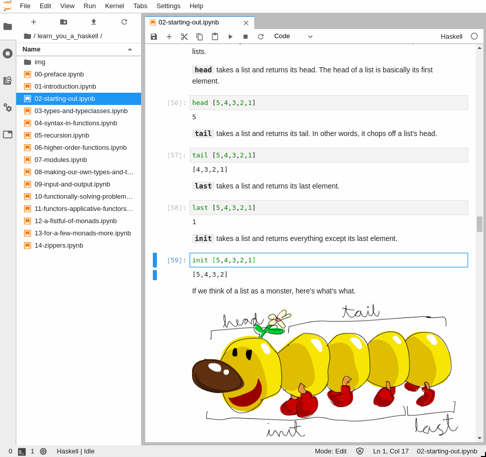

# Learn You a Haskell for Great Good!

Read the book right now on __mybinder.org__ with this link: [![launch Learn You a Haskell for Great Good!](https://img.shields.io/badge/launch-Learn%20You%20A%20Haskell%20For%20Great%20Good!-579ACA.svg?logo=data:image/png;base64,iVBORw0KGgoAAAANSUhEUgAAAFkAAABZCAMAAABi1XidAAAB8lBMVEX///9XmsrmZYH1olJXmsr1olJXmsrmZYH1olJXmsr1olJXmsrmZYH1olL1olJXmsr1olJXmsrmZYH1olL1olJXmsrmZYH1olJXmsr1olL1olJXmsrmZYH1olL1olJXmsrmZYH1olL1olL0nFf1olJXmsrmZYH1olJXmsq8dZb1olJXmsrmZYH1olJXmspXmspXmsr1olL1olJXmsrmZYH1olJXmsr1olL1olJXmsrmZYH1olL1olLeaIVXmsrmZYH1olL1olL1olJXmsrmZYH1olLna31Xmsr1olJXmsr1olJXmsrmZYH1olLqoVr1olJXmsr1olJXmsrmZYH1olL1olKkfaPobXvviGabgadXmsqThKuofKHmZ4Dobnr1olJXmsr1olJXmspXmsr1olJXmsrfZ4TuhWn1olL1olJXmsqBi7X1olJXmspZmslbmMhbmsdemsVfl8ZgmsNim8Jpk8F0m7R4m7F5nLB6jbh7jbiDirOEibOGnKaMhq+PnaCVg6qWg6qegKaff6WhnpKofKGtnomxeZy3noG6dZi+n3vCcpPDcpPGn3bLb4/Mb47UbIrVa4rYoGjdaIbeaIXhoWHmZYHobXvpcHjqdHXreHLroVrsfG/uhGnuh2bwj2Hxk17yl1vzmljzm1j0nlX1olL3AJXWAAAAbXRSTlMAEBAQHx8gICAuLjAwMDw9PUBAQEpQUFBXV1hgYGBkcHBwcXl8gICAgoiIkJCQlJicnJ2goKCmqK+wsLC4usDAwMjP0NDQ1NbW3Nzg4ODi5+3v8PDw8/T09PX29vb39/f5+fr7+/z8/Pz9/v7+zczCxgAABC5JREFUeAHN1ul3k0UUBvCb1CTVpmpaitAGSLSpSuKCLWpbTKNJFGlcSMAFF63iUmRccNG6gLbuxkXU66JAUef/9LSpmXnyLr3T5AO/rzl5zj137p136BISy44fKJXuGN/d19PUfYeO67Znqtf2KH33Id1psXoFdW30sPZ1sMvs2D060AHqws4FHeJojLZqnw53cmfvg+XR8mC0OEjuxrXEkX5ydeVJLVIlV0e10PXk5k7dYeHu7Cj1j+49uKg7uLU61tGLw1lq27ugQYlclHC4bgv7VQ+TAyj5Zc/UjsPvs1sd5cWryWObtvWT2EPa4rtnWW3JkpjggEpbOsPr7F7EyNewtpBIslA7p43HCsnwooXTEc3UmPmCNn5lrqTJxy6nRmcavGZVt/3Da2pD5NHvsOHJCrdc1G2r3DITpU7yic7w/7Rxnjc0kt5GC4djiv2Sz3Fb2iEZg41/ddsFDoyuYrIkmFehz0HR2thPgQqMyQYb2OtB0WxsZ3BeG3+wpRb1vzl2UYBog8FfGhttFKjtAclnZYrRo9ryG9uG/FZQU4AEg8ZE9LjGMzTmqKXPLnlWVnIlQQTvxJf8ip7VgjZjyVPrjw1te5otM7RmP7xm+sK2Gv9I8Gi++BRbEkR9EBw8zRUcKxwp73xkaLiqQb+kGduJTNHG72zcW9LoJgqQxpP3/Tj//c3yB0tqzaml05/+orHLksVO+95kX7/7qgJvnjlrfr2Ggsyx0eoy9uPzN5SPd86aXggOsEKW2Prz7du3VID3/tzs/sSRs2w7ovVHKtjrX2pd7ZMlTxAYfBAL9jiDwfLkq55Tm7ifhMlTGPyCAs7RFRhn47JnlcB9RM5T97ASuZXIcVNuUDIndpDbdsfrqsOppeXl5Y+XVKdjFCTh+zGaVuj0d9zy05PPK3QzBamxdwtTCrzyg/2Rvf2EstUjordGwa/kx9mSJLr8mLLtCW8HHGJc2R5hS219IiF6PnTusOqcMl57gm0Z8kanKMAQg0qSyuZfn7zItsbGyO9QlnxY0eCuD1XL2ys/MsrQhltE7Ug0uFOzufJFE2PxBo/YAx8XPPdDwWN0MrDRYIZF0mSMKCNHgaIVFoBbNoLJ7tEQDKxGF0kcLQimojCZopv0OkNOyWCCg9XMVAi7ARJzQdM2QUh0gmBozjc3Skg6dSBRqDGYSUOu66Zg+I2fNZs/M3/f/Grl/XnyF1Gw3VKCez0PN5IUfFLqvgUN4C0qNqYs5YhPL+aVZYDE4IpUk57oSFnJm4FyCqqOE0jhY2SMyLFoo56zyo6becOS5UVDdj7Vih0zp+tcMhwRpBeLyqtIjlJKAIZSbI8SGSF3k0pA3mR5tHuwPFoa7N7reoq2bqCsAk1HqCu5uvI1n6JuRXI+S1Mco54YmYTwcn6Aeic+kssXi8XpXC4V3t7/ADuTNKaQJdScAAAAAElFTkSuQmCC)](https://mybinder.org/v2/gh/IHaskell/learn-you-a-haskell-notebook/master?urlpath=lab/tree/learn_you_a_haskell/00-preface.ipynb)
(Usually takes a minute to launch)

---



This is a Jupyter notebook adaptation of the book [__*Learn You a Haskell for Great Good!*__](http://learnyouahaskell.com/) by Miran Lipovača.

I learned Haskell from this book in 2014 by following along in [GHCI](https://downloads.haskell.org/~ghc/latest/docs/html/users_guide/ghci.html), as the book suggested.

In 2019, the [Jupyter](https://jupyter.org/) notebook format would be a nice way read this book. This is one of the best cases for Theodore Gray's idea of the [computational essay](https://www.theatlantic.com/science/archive/2018/04/the-scientific-paper-is-obsolete/556676/), and Andrew Gibiansky has made it possible with [IHaskell](https://github.com/IHaskell/IHaskell).

Each chapter of the book is one `.ipynb` Jupyter notebook file. See the list of chapter files on the left sidebar in JupyterLab.

Each notebook cell depends on cells that come before it, so run the notebooks from top to bottom. I have refactored code to make the examples work in Jupyter, and removed instructions for how to use GHCI. Other than that I have tried to be faithful to the original text.

Miran Lipovača wrote this book and released it to the world under a [Creative Commons Attribution-Noncommercial-Share Alike 3.0 Unported License](http://creativecommons.org/licenses/by-nc-sa/3.0/), which means that the book is free-as-in-speech, and allows us to enjoy the book in notebook format. But that does not mean that the book is free-as-in-beer; it means that you, dear reader, pay for the book under the honor system. If you are honorable and you want to keep living in a world in which honorable artists license their art as Creative Commons, then [buy the book](http://learnyouahaskell.com/).

Thanks also to Paul Vorbach for <https://github.com/pvorb/learn-you-a-haskell>.

# How to run on your local computer in Visual Studio Code

Visual Studio Code has a
[Notebook UI](https://code.visualstudio.com/docs/datascience/jupyter-notebooks)
which you can use to run Jupyter kernels instead of the browser-based
JupyterLab or classic Jupyter UI.

Clone this repository with `git` and `cd` into the cloned directory

```bash
git clone https://github.com/IHaskell/learn-you-a-haskell-notebook.git
cd learn-you-a-haskell-notebook
code .
```

There is a Docker
[Visual Studio Code devcontainer](https://github.com/microsoft/vscode-dev-containers)
configuration in the [`.devcontainer`](.devcontainer) directory.

When you open Visual Studio Code by running `code .`, a pop-up dialog will
tell you that “Folder contains a Dev Container configuration file. Reopen folder
to develop in a container.” Click the button labelled __Reopen in Container__.

You will then be able to open the `.ipynb` chapter files in the `notebook`
directory.

# How to run on your local computer in JupyterLab in a web browser

Clone this repository with `git` and `cd` into the cloned directory

```bash
git clone https://github.com/IHaskell/learn-you-a-haskell-notebook.git
cd learn-you-a-haskell-notebook
```

Then here are three options for running.

1. `docker`

   ```bash
   docker run --rm -p 8888:8888 -v $PWD/notebook:/home/jovyan/work --name learn-you-a-haskell ghcr.io/ihaskell/ihaskell-notebook:master jupyter lab --ServerApp.token=''
   ```

   then open [http://localhost:8888](http://localhost:8888) to read the book.

2. `podman`

   ```bash
   podman run --privileged --userns=keep-id --rm -p 8888:8888 -v $PWD/notebook:/home/jovyan/work --name learn-you-a-haskell ghcr.io/ihaskell/ihaskell-notebook:master jupyter lab --ServerApp.token=''
   ```

   then open [http://localhost:8888](http://localhost:8888) to read the book.

3. [NixOS](https://nixos.org/) flake

   ```
   nix run . -- --notebook-dir notebook
   ```

   then the book will open in a browser automatically. If it doesn’t, open the “running at” link.

# How to edit notebooks

If you make an improvement to a notebook `.ipynb` file and you want to save the file and commit the changes and make a pull request to the repository,

1. Maximize the browser window to full screen width, because cell horizontal scroll bar visibility gets saved in the notebook.

2. Run -> Restart kernel and Run All Cells...

3. Save the notebook.

# ihaskell-notebook

For more information about the IHaskell Docker image, see <https://github.com/IHaskell/ihaskell-notebook>

